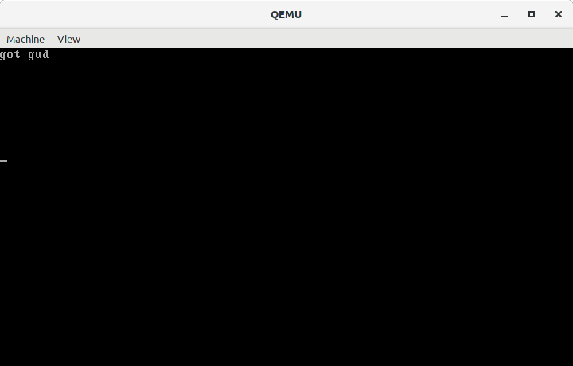

# µkernel

My first attempt at writing a kernel.

It just displays a string and then ~~sits in corner staring at you.~~
takes user input and displays it!



## Clone it!

```
git clone git@gitlab.com:alifarazz/ukernel.git
```

## Install it!

I've only tested it in a Linux environment.

You'll need: 
* `gcc` to compile C files
* `gnu make` to automate build process
* `nasm` the assembler
* `qemu` to run the kernel [optional]

## Use it!

```sh
make run
```

## Support!

Open an issue and I'll look into it!

## Contribute to it!

Fork the project, create a new branch, make your changes, and submit a merge request.
