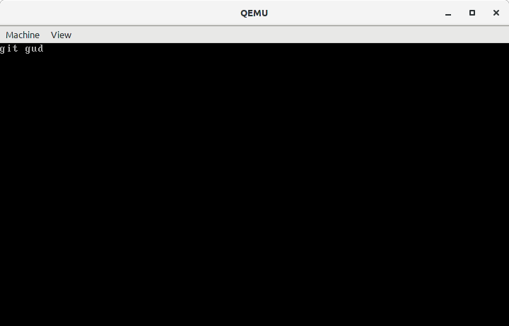

# µkernel

My first attempt at writing a kernel.
It just displays a string and then sits in corner staring at you.



## Clone it!

```
git clone git@gitlab.com:alifarazz/mkernel.git
```

## Install it!

I've only tested it in a Linux environment.

You'll need: 
* `gcc` to compile C files
* `gnu make` to automate build process
* `nasm` the assembler
* `qemu` to run the kernel [optional]

## Use it!

```sh
git clone git@gitlab.com:alifarazz/mkernel.git
make
make run
```

## Support!

Please open an issue to receive support for this project.

## Contribute to it!

Fork the project, create a new branch, make your changes, and submit a merge request.
